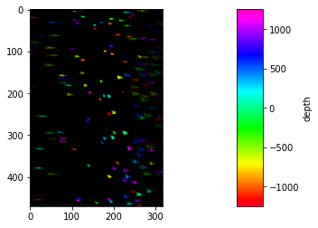

# Pycroscopy3D
---

[](https://doi.org/10.5281/zenodo.7660286)

Pycroscopy3D is a collection of tools for microscopy.

### Features
- Easy 3D-stack manipulation with [multipagetiff](https://github.com/mpascucci/multipagetiff)
- Straightforward extraction of **average PSF** from a volumetric image of point-like objects
- 3D deconvolution (using [iocbio/deconvolve](https://gitlab.com/iocbio/deconvolve)
- Stack registration (using [ANTsPy](https://github.com/ANTsX/ANTsPy))

## Example use


```python
import pycroscopy3D as pycro
```


```python
# load a stack (volumetric image) of fluorescent beads
stack_path = "./psf_stack.tiff"
s = pycro.read_stack(stack_path)
s
```


    Multi-Page Stack of 2500 pages. (dx=dy=1, dz=1, crop=[0, 470, 0, 317]], page limits=[0, 2500])


```python
# plot the Z-max-projection of the stack
pycro.plot_flatten(s)
```


    

    


```python
# initialize the average PSF calculation
psf = pycro.PSF(s,size_tolerance=0.7)
psf
```


    PSF generator: found 33 objects, 17 rejected (wrong size).


```python
# Calculate the average PSG
psf.calc_mean_psf()
```

    Find centroids: 100%|██████████| 16/16 [00:57<00:00,  3.62s/it]
    Crop PSFs: 100%|██████████| 16/16 [00:00<00:00, 12555.45it/s]


```python
# plot the mean PSF
mean_psf = psf.mean_PSF
pycro.orthogonal_views(mean_psf)
```


    

    

